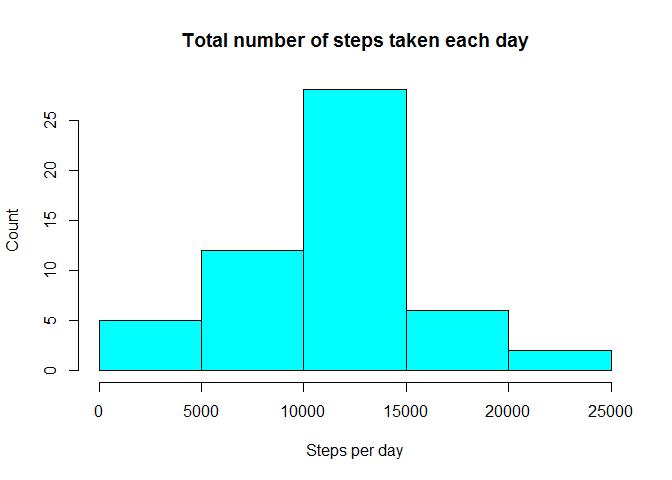
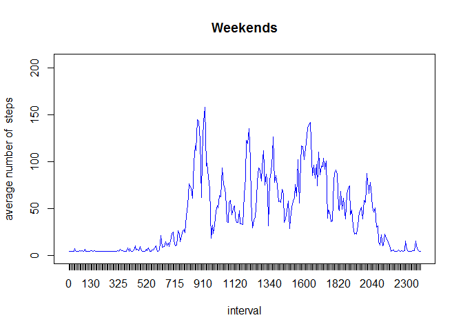

# Reproducible Research: Peer Assessment 1

## SETUP 

```r
knitr::opts_chunk$set(echo = TRUE)
```
## Loading and preprocessing the data
Load the data (i.e. read.csv())


```r
if(!file.exists("repdata%2Fdata%2Factivity.zip") | !file.exists("activity.csv") )
{
        fileUrl <- "https://d396qusza40orc.cloudfront.net/repdata%2Fdata%2Factivity.zip"
        download.file(fileUrl,destfile="repdata%2Fdata%2Factivity.zip")
        unzip(zipfile="repdata%2Fdata%2Factivity.zip",exdir=".")
}

activity <- read.csv("activity.csv", header = T)
head(activity)
```

```
##   steps       date interval
## 1    NA 2012-10-01        0
## 2    NA 2012-10-01        5
## 3    NA 2012-10-01       10
## 4    NA 2012-10-01       15
## 5    NA 2012-10-01       20
## 6    NA 2012-10-01       25
```

Process/transform the data (if necessary) into a format suitable for your analysis


```r
#no processing
```

## What is mean total number of steps taken per day?
For this part of the assignment, you can ignore the missing values in the dataset.

#### Make a histogram of the total number of steps taken each day


```r
# split per day
stepsPerDay <- split(activity$steps, activity$date)
TotalStepsPerDay <- sapply(stepsPerDay, sum)

# make histogram
hist(TotalStepsPerDay, 
     xlab="Steps per day", 
     ylab="Count", 
     main="Total number of steps taken each day",
     col=5)
```

<!-- -->

#### Calculate and report the mean and median total number of steps taken per day


```r
# calculate mean and median
meanTotalSteps <- prettyNum(mean(TotalStepsPerDay, na.rm = TRUE), scientific=FALSE) 
medianTotalSteps <- prettyNum(median(TotalStepsPerDay, na.rm = TRUE), scientific=FALSE)
```
The mean total number of steps taken per day are 10766.19.
The median total number of steps taken per day are 10765.

## What is the average daily activity pattern?
#### Make a time series plot (i.e. type = "l") of the 5-minute interval (x-axis) and the average number of steps taken, averaged across all days (y-axis)


```r
stepsPerInterval <- split(activity$steps, activity$interval)
MeanStepsPerInterval <- sapply(stepsPerInterval, mean, na.rm = TRUE)
intervals <- factor(unique(activity$interval))

# making the plot
plot(intervals, MeanStepsPerInterval, lty = 0,  xlab = "interval", ylab = "average number of  steps", main = "Average daily activity pattern")
# adding lines
lines(intervals, MeanStepsPerInterval, lty = 1, lwd = 1, col = "black")
```

<!-- -->

#### Which 5-minute interval, on average across all the days in the dataset, contains the maximum number of steps?


```r
MaxSteps <- max(MeanStepsPerInterval)
MaxInterval <- intervals[MeanStepsPerInterval == MaxSteps]
```

The interval with the maximum average number of steps is interval 835.

## Imputing missing values

Note that there are a number of days/intervals where there are missing values (coded as NA). The presence of missing days may introduce bias into some calculations or summaries of the data.

#### Calculate and report the total number of missing values in the dataset (i.e. the total number of rows with NAs)

```r
missingValues <- sum(is.na(activity$steps)) + sum(is.na(activity$date)) + sum(is.na(activity$interval))
```
There are 2304 missing values in the dataset.


###Devise a strategy for filling in all of the missing values in the dataset. The strategy does not need to be sophisticated. For example, you could use the mean/median for that day, or the mean for that 5-minute interval, etc.

My strategy will be to fill eacht missing value with the overall average number of steps per interval.

### Create a new dataset that is equal to the original dataset but with the missing data filled in.


```r
## new dataframe, to keep the original untouched
imputed <- activity

## Any steps value that is NA, is filled with the overall mean number of steps per interval
missingSteps <- is.na(imputed$steps)
imputed$steps[missingSteps] <- mean(activity$steps, na.rm = TRUE)
missingValuesImputed <- sum(is.na(imputed$steps)) + sum(is.na(imputed$date)) + sum(is.na(imputed$interval))
```
There are 0 missing values left in the imputed dataset.
```
#### Make a histogram of the total number of steps taken each day and Calculate and report the mean and median total number of steps taken per day. Do these values differ from the estimates from the first part of the assignment? What is the impact of imputing missing data on the estimates of the total daily number of steps?


```r
# split per day
imputedStepsPerDay <- split(imputed$steps, imputed$date)
imputedTotalStepsPerDay <- sapply(imputedStepsPerDay, sum)

# make histogram
hist(imputedTotalStepsPerDay, 
     xlab="Steps per day", 
     ylab="Count", 
     main="Total number of steps taken each day after imputing",
     col=6)
```

<!-- -->

#### Calculate and report the mean and median total number of steps taken per day


```r
# calculate mean and median
imputedMeanTotalSteps <- prettyNum(mean(imputedTotalStepsPerDay, na.rm = TRUE), scientific=FALSE) 
imputedMedianTotalSteps <- prettyNum(median(imputedTotalStepsPerDay, na.rm = TRUE), scientific=FALSE)
```
After imputing the mean total number of steps taken per day are 10766.19.
The median total number of steps taken per day are 10766.19.

## Are there differences in activity patterns between weekdays and weekends?

#### Create a new factor variable in the dataset with two levels – “weekday” and “weekend” indicating whether a given date is a weekday or weekend day.

#### Make a panel plot containing a time series plot (i.e. type = "l") of the 5-minute interval (x-axis) and the average number of steps taken, averaged across all weekday days or weekend days (y-axis). See the README file in the GitHub repository to see an example of what this plot should look like using simulated data.


```r
# Determining weekenddays eand weekdays - weekenddays in dutch are "zaterdag"  and "zondag"
imputed$dayName <- weekdays(as.Date(imputed$date))
imputed$weekend <- ifelse(imputed$dayName%in% c("zaterdag", "zondag"), TRUE, FALSE)
```
#### Make a panel plot containing a time series plot (i.e. type = "l") of the 5-minute interval (x-axis) and the average number of steps taken, averaged across all weekday days or weekend days (y-axis). See the README file in the GitHub repository to see an example of what this plot should look like using simulated data.


As extra I made one plot with 2 lines (one for weekend and one for weekdays. This makes it easier to compare the patterns.


```r
# Weekend
weekend <- imputed[imputed$weekend == TRUE,]
weekendImputedStepsPerInterval <- split(weekend$steps, weekend$interval)
weekendImputedMeanStepsPerInterval <- sapply(weekendImputedStepsPerInterval, mean, na.rm = TRUE)
weekendImputedIntervals <- factor(unique(weekend$interval))

# Weekdays
week <- imputed[imputed$weekend == FALSE,]
weekImputedStepsPerInterval <- split(week$steps, week$interval)
weekImputedMeanStepsPerInterval <- sapply(weekImputedStepsPerInterval, mean, na.rm = TRUE)
weekImputedIntervals <- factor(unique(week$interval))

# building the plot weekenddays
# original layout
plot(intervals, MeanStepsPerInterval, lty = 0,  xlab = "interval", ylab = "average number of  steps", main = "Weekends")
# adding lines
lines(weekendImputedIntervals, weekendImputedMeanStepsPerInterval, lty = 1, lwd = 1, col = "blue")
```

<!-- -->

```r
# building the plot weekdays
# original layout
plot(intervals, MeanStepsPerInterval, lty = 0,  xlab = "interval", ylab = "average number of  steps", main = "Weekdays")
# adding lines
lines(weekImputedIntervals, weekImputedMeanStepsPerInterval, lty = 1, lwd = 1, col = "red")
```

<!-- -->

```r
# adding legend
```
As extra I made one plot with 2 lines (one for weekend and one for weekdays. This makes it easier to compare the patterns.


```r
# building the plot
# original layout
plot(intervals, MeanStepsPerInterval, lty = 0,  xlab = "interval", ylab = "average number of  steps", main = "Weekends vs Weekdays")
# adding lines
lines(weekendImputedIntervals, weekendImputedMeanStepsPerInterval, lty = 1, lwd = 1, col = "blue")
lines(weekImputedIntervals, weekImputedMeanStepsPerInterval, lty = 1, lwd = 1, col = "red")
# adding legend
legend("topright", pch = 1, col = c("blue", "red"), legend = c("Weekenddays", "Weekdays"))
```

<!-- -->


YES, the pattern in the weekend differs from the pattern in the workingweekdays.
